<h1 align="center">もかのほーむ — 愛犬の記録と買い物の管理アプリ<br>作品説明資料</h1>

愛犬「もか」の毎日（ごはん・ワクチン・フィラリア・トリミング・通院）と、ペット用品の通販サイトで買ったものを1か所にまとめた **個人開発の Web アプリケーション** である。企画・設計・実装・デプロイ・運用を一人で行い、自分の生活で実際に使っている。

| 項目 | 内容 |
|---|---|
| 氏名 | 木村 大暉 |
| 区分 | 個人開発（Webアプリケーション／自分で日常的に使用） |
| ソースコード | https://github.com/mocaluna0117/moca_home |
| 動作紹介動画 | https://github.com/mocaluna0117/moca_home/blob/main/docs/portfolio/moca-home-demo.mp4（約2分50秒） |
| 本番環境 | 購入履歴や証明書の写真を含むためパスワード保護で非公開（動画と下記の手順で確認いただけます） |

> 本資料の画面写真と動画は、手元に別に立てたデモ環境で、**すべて架空のデータ**（架空の商品・架空の接種証明書・犬のイラスト）を使って撮影した。アプリのコードは本番と同一である。

<p align="center">
  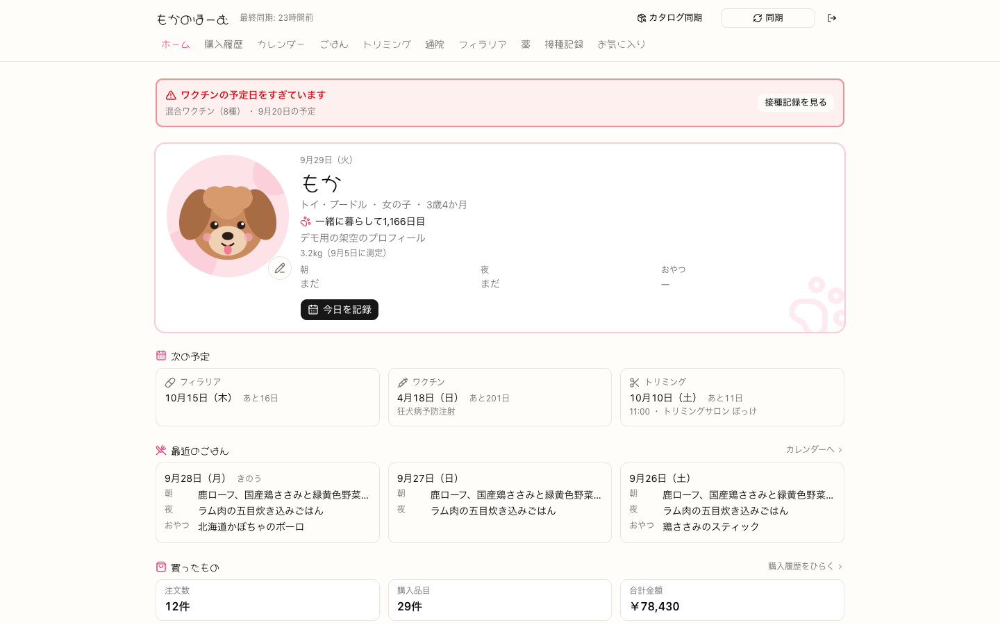
</p>

---

## 1. 制作意図

愛犬の世話では、記録があちこちに散らばる。ごはんはメモ帳、ワクチンは紙の証明書、フィラリアの薬はカレンダーアプリ、トリミングの予約はお店からの連絡、フードやおやつの購入履歴は通販サイトのマイページ、という具合で、**「この子はいつからこのごはんを食べているか」「次のワクチンはいつか」にすぐ答えられない**状態だった。

特に購入履歴は、通販サイトの商品名が「9:00〜9:30♡30分限定販売！【新しくなったよ♡】…合計3コご注文で＋1コプレゼント」のような **60〜140文字の宣伝文** で、一覧で見ても何を買ったのか読み取れない。さらに、商品名の中に書かれた「おまけ」の条件（何個買うと何が付くか）が、自分で数えないと分からなかった。

そこで次の3つを目標にした。

- **1画面で「今日のこと」と「次にやること」が分かる**こと（ホームに、今日のごはん・次の予定・期限切れの警告を出す）
- **入力の手間を減らす**こと（通販の購入履歴は自動で取り込み、毎日同じごはんは自動で記録し、証明書は写真から読み取る）
- **個人情報を不用意に残さない・送らない**こと（証明書や注文には氏名・住所が載っている）

---

## 2. 開発概要（提出要項の必須項目）

| 項目 | 内容 |
|---|---|
| **開発期間** | 2026年8月27日〜9月8日（13日間）。以降も日常的に使い続けている |
| **所要時間（概算）** | 約287時間（リポジトリを作成した2026年8月27日2時2分から、最後のコミットの9月8日0時49分までの経過時間） |
| **開発メンバー数・構成** | 1名 |
| **自身の担当範囲** | 全工程。欲しい機能の洗い出し、画面とデータの設計、実装、Vercel・Turso への構築、本番データの移行、自分での日常利用と改善 |
| **動作環境** | モダンブラウザ（Chrome / Edge / Safari）。PC・スマートフォン両対応。サーバは Vercel（東京リージョン）、DB は Turso |
| **操作方法** | パスワードでログインし、上部のタブ（ホーム・購入履歴・カレンダー・ごはん・トリミング・通院・フィラリア・薬・接種記録・お気に入り）で画面を切り替える。記録は各画面の「記録」ボタンから入れる。購入履歴は右上の「同期」ボタンで通販サイトから取り込む（詳しくは「4. 主な機能」と動画） |
| **規模** | TypeScript 約25,500行（テストを除く。うち UI 部品の生成コード 約700行）＋ テスト 約3,400行・394件。画面13・DBテーブル20。コミット62件（本資料を追加したコミットを除く） |
| **扱っているデータ（本番）** | 注文69件・明細129件、通販サイトの商品カタログ1,120件（いずれも開発時点のコミットに記録された件数） |

---

## 3. 技術スタックとアーキテクチャ

| レイヤ | 技術 |
|---|---|
| フロントエンド / サーバ | **Next.js 16（App Router）**, React 19, TypeScript。読み取りは Server Components が DB を直接読み、書き込みは Server Actions |
| UI | Tailwind CSS v4, shadcn/ui（Base UI） |
| DB | **SQLite 互換の libSQL**（本番は Turso、ローカルは SQLite のファイル）＋ Drizzle ORM |
| 写真・PDF | Vercel Blob（private）。ブラウザから直接アップロード |
| 通販サイトの取り込み | fetch + cheerio（ヘッドレスブラウザを使わない HTML 解析） |
| AI | 接種証明書の読み取りに Gemini API（未設定なら Claude API） |
| 定期実行・通知 | Vercel Cron（毎朝1回）, nodemailer + Gmail |
| テスト | node:test（tsx で実行） |
| インフラ | Vercel（Hobby プラン・東京 hnd1）, Turso（東京） |

### アーキテクチャ

<p align="center">
  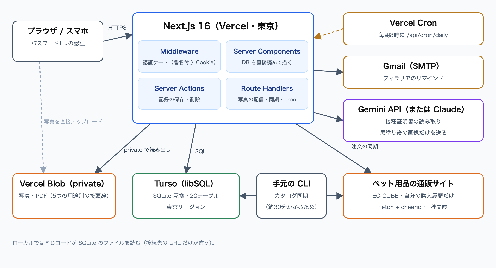
</p>

- **判定のロジックは純粋な関数に分け、画面は受け取ったものを描くだけにした。** おまけの判定・商品名の抽出・予定日の生成・証明書の後処理などは DB にも画面にも依存しない関数で、394件のテストはほぼすべてここを検証している
- **写真の本体は関数を通さない。** Vercel の関数はリクエスト本文が 4.5MB までで、スマホの写真（3〜12MB）が通らない。ブラウザから Blob へ直接上げ、関数は「どこに上げてよいか」のトークンだけを発行する
- **時間のかかる処理は実行場所を分けた。** 注文の同期（初回2〜3分・以降10秒程度）は本番の画面から実行できるが、カタログの同期（約30分）は関数の上限（300秒）を超えるため手元の CLI からだけ実行する

---

## 4. 主な機能

### 買ったものを見る

- **購入履歴の自動取り込み** … 通販サイトにログインして自分の注文だけを取得する。1秒間隔で取りに行き、取得済みのものは取り直さない（2回目以降は10秒程度）
- **商品名の「芯」を太字に** … 長い宣伝文の中から「何の商品か」の部分だけを抽出して強調する。全文は1文字も削らない
- **おまけの予測と記録** … 商品名に書かれたおまけの条件を読み取り、同じ注文の中で合算して「+1コ」などを予測する。届いたら予測をそのまま取り込んで記録でき、写真も残せる
- **商品の詳細** … 何回・何点買ったか、いつから食べているか
- **添付・お気に入り・検索** … 領収書の PDF の添付、お気に入りの星、全商品からの検索

<p align="center">
  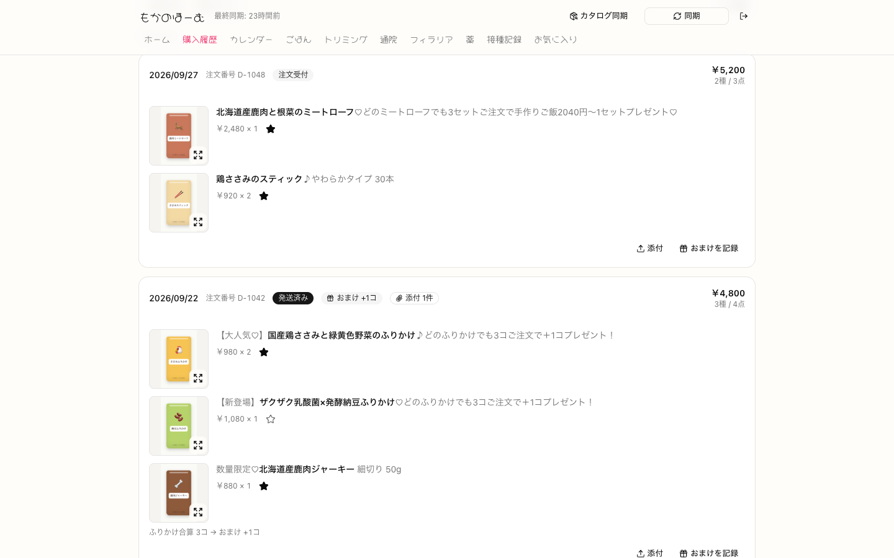
  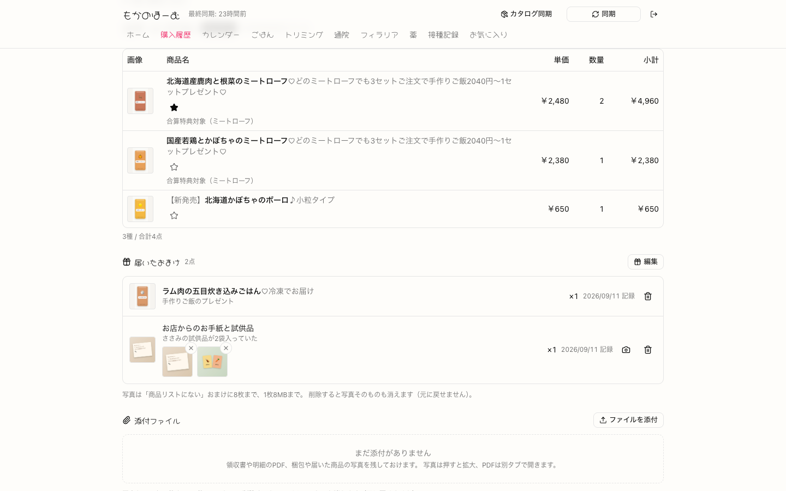
</p>
<p align="center">
  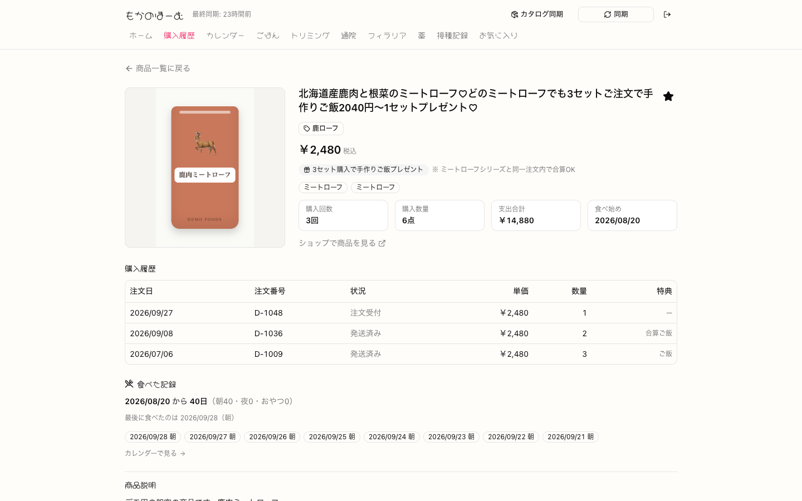
</p>
<p align="center"><sub>左上: 購入履歴（太字が抽出した商品名、下に「ふりかけ合算 3コ → おまけ +1コ」） ／ 右上: 注文詳細（届いたおまけ・写真・まだ届いていない分の予測） ／ 下: 商品の詳細</sub></p>

### 毎日を記録する

- **カレンダー** … その日のごはん（朝・夜・おやつ）と、トリミング・通院・フィラリア・ワクチンの印。予定は破線で出す
- **いつものご飯** … 登録しておくと、毎朝8時の定期実行がその日の記録に入れる
- **接種証明書の読み取り** … 写真を選ぶと、**送る前に氏名・住所を黒く塗れる**画面が開き、塗った画像だけを AI に送って接種日・ワクチン名・動物病院・次回予定日を入力欄に入れる。保存するのは人
- **フィラリア** … シーズン分の投薬日をまとめて作り、予定日の朝にメールで知らせる
- **トリミング・通院・薬** … 予約（金額は未確定のまま保存できる）と明細つきの記録、年ごとの回数と金額

<p align="center">
  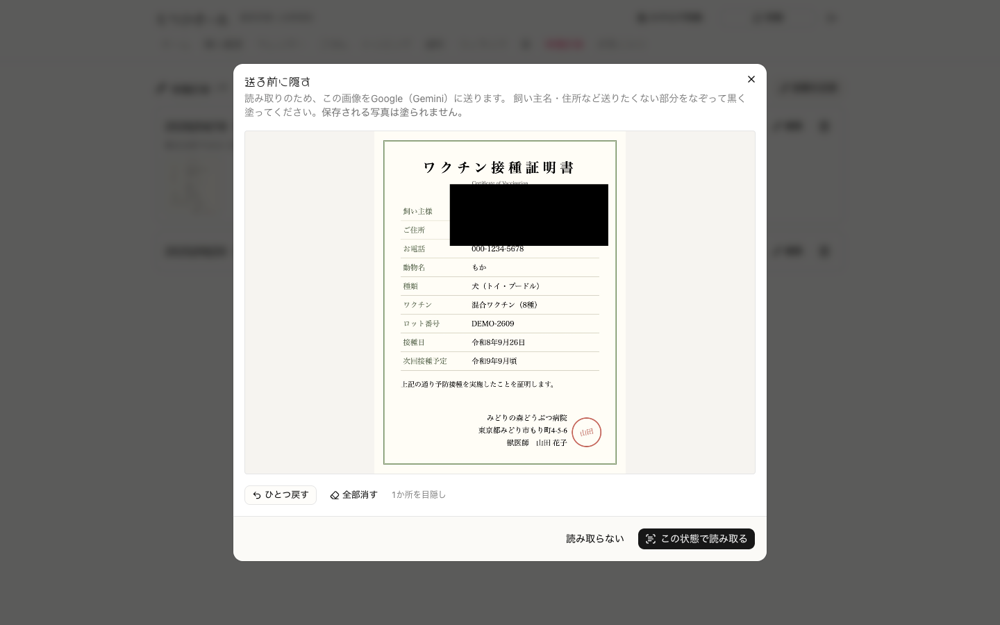
  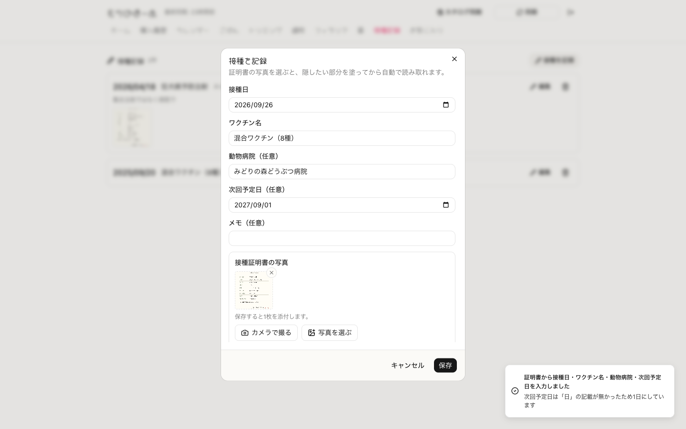
</p>
<p align="center">
  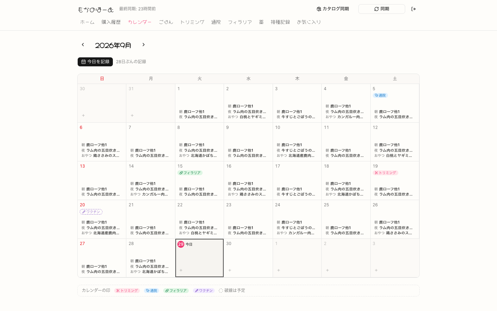
  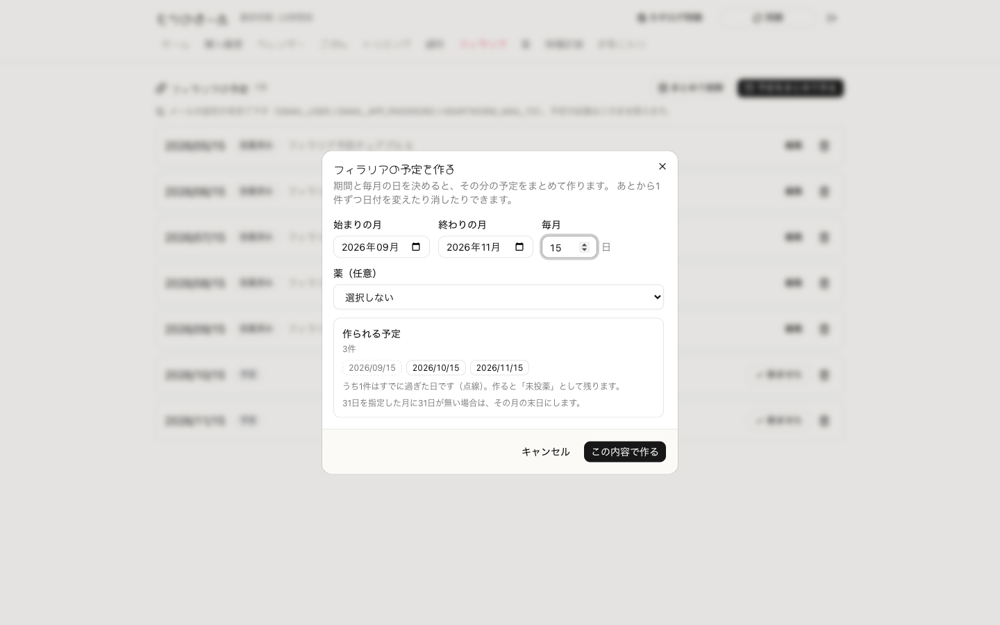
</p>
<p align="center"><sub>左上: 送る前に隠す（保存される写真は塗られない） ／ 右上: 読み取り結果（院長名は捨て、和暦は西暦に、年月だけの次回予定は1日で補う） ／ 左下: カレンダー ／ 右下: 過ぎた日は点線で知らせる</sub></p>

<p align="center">
  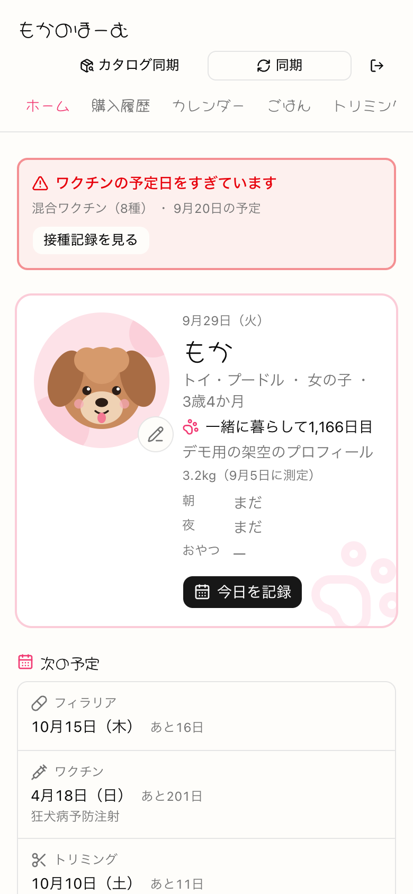
  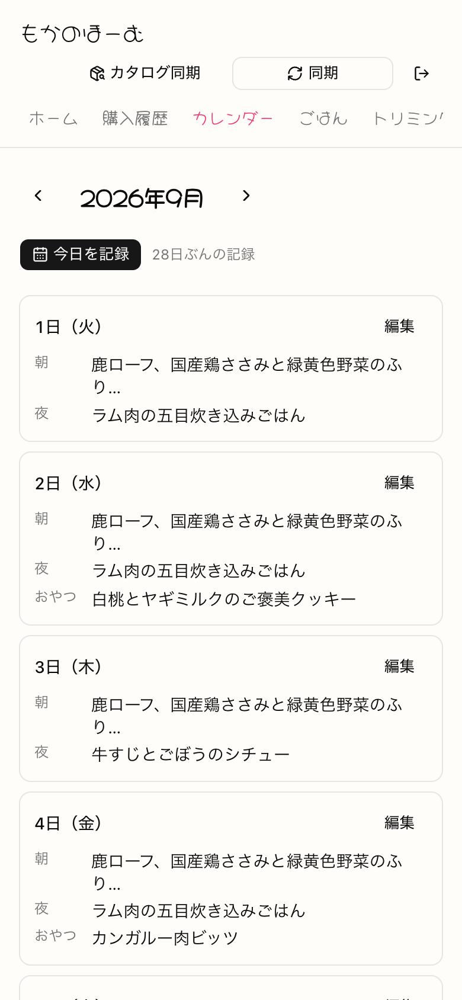
</p>
<p align="center"><sub>スマートフォンでの表示（カレンダーは7列に文字が収まらないため、日ごとのリストに切り替える）</sub></p>

---

## 5. 技術的に工夫した点

### (1) 読めない商品名を、実データ全件で検証しながら構造にした 🔍

通販サイトの商品名には、商品そのものの名前・宣伝文句・おまけの条件が1本の文字列に混ざっている。おまけの条件は少なくとも3種類の書き方があり（「Nコご注文で＋Mコプレゼント」「3セットで手作りご飯プレゼント」「3コ＋おまけ1コのお得セット」）、全角数字・表記ゆれ・「ご注文で注文で」のような誤記・「＋1コとおやつ6袋」のような複合もある。

- **おまけの判定は「迷ったら少なく出す」を原則にした。** 「どのふりかけでも」「〜と合わせてもOK」のように **合算してよい根拠が文字として書かれている場合だけ** 同じ注文内の数量を合算し、根拠が無ければ商品ごとに判定する。過大に「もらえるはず」と出すと、届かなかったときにお店を疑うことになるためである。発動数は floor(合算数量 / 閾値) × M 個とした
- **実データ全件で確かめた。** 購入履歴の全129明細で3種類の条件を 51 / 30 / 5 件抽出し、取りこぼし0件、69注文中43注文で発動、過大判定なしを確認した（テスト25件で固定）
- **商品名の芯の抽出は、一度作った方式を測って作り直した。** 最初は1,236件の商品名の頻度から作った「商品の種類の辞書」（ミートローフ・ふりかけ等）に当たった語だけを強調したが、実際に見ると「ご飯」「グラノーラ」だけが太字になり何の商品か分からなかった。そこで **宣伝句とおまけ条件を先にすべて伏せてから、区切り文字（♡♪【】など）まで左に伸ばす** 方式に変えた。伏せてあるので、伸ばすと自然に材料名で止まる

| 指標（実データ） | 初版 | 改良後 |
|---|---|---|
| 抽出できた割合 | 97.6%（1,236件全体。購入履歴は99.1%） | 購入履歴 99.1% / カタログ 97.4% |
| 強調部分の平均の長さ | 6文字 | 10.7文字 |
| 「ご飯」だけが強調される商品 | 55件 | 5件 |
| 「グラノーラ」だけが強調される商品 | 106件 | 12件 |

途中で、「もちもちポーク」の先頭の「も」を助詞と誤認して削る不具合を見つけ、先頭の除去を記号だけに限定した。抽出できなかったときは全文をそのまま出す（誤った強調より、強調しないほうがよい）。

### (2) 証明書の読み取りで、個人情報を「送らない・残さない」 🛡️

接種証明書には飼い主の氏名・住所・電話が写っている。自動入力は便利だが、その画像を外部の AI に送ることになる。

- **まず端末内で文字認識（OCR）できないかを実測した。** tesseract.js で試すと、きれいな合成画像でも設定によって「ワクチン名の行が丸ごと消える」「日付の行が2つとも消える」「令和 → 信和」となり、**日付とワクチン名を同時に取れる設定が無かった**。実物は日付が手書きのことも多いため、この方法は採らなかった
- **AI に送る前に、画面上で黒く塗れるようにした。** 塗るのは送信用の複製だけで、保存される写真は原本のままにした（記録としての価値を落とさないため）。送信するバイト列に塗りが反映されていることも確認した
- **AI の出力をそのまま信じず、決定的な後処理にかける。** 和暦の変換は AI にやらせず関数で行う（テストできるため）。日付の候補が2つ以上ある文字列（「接種 2025/5/3 次回 2026/5/3」）は採らない。自由記述の欄は自動入力しない（そこが個人情報の抜け道になる）
- **病院名から人名を落とす方式は、反例で2回作り直した。** 最初は「住所・電話・院長を含んだら捨てる」除外方式だったが、「さくら動物病院 田中太郎」のような **素の氏名が素通りする** ことを実例で確認した。列挙では人名を防ぎきれないため、「動物病院」「クリニック」などの施設を表す語までを名前とみなす方式に変えた。ところが今度は英語名（Sakura Animal Hospital → Hospital）や地名を含む正当な名前を壊したため、最終的に「空白で離れて続く語は捨て、くっついて続く短い語（分院名など）は残す」形に落ち着いた。**個人情報つき10例・正当な名前11例の計21例で誤りが0件** であることを確かめている
- **応答が来ない場合も必ず返す。** SDK は上流が返す待ち時間の指示に従って再試行するため、1回ぶんのタイムアウトを短くしても合計が関数の上限（60秒）を超えうる。全体の締切を40秒にし、120秒待てと返す上流に対して **40.2秒で打ち切って「手入力してください」と返す** ことを確認した

### (3) 認証の抜け穴を、実際にアクセスして確かめてから塞いだ 🔒

リポジトリを公開しているため、コードを読めば誰でも経路が分かる。ある日、次の差に気づいた。

```
GET /api/vaccination-photos/1      → 401（正しく拒否）
GET /api/vaccination-photos/1.jpg  → 200（証明書の画像が返る）
```

原因は2つの組み合わせだった。(1) 認証の対象から「拡張子で終わるパス」をまとめて外していた（守る静的ファイルは実は1つも無かった）、(2) ID の解釈に `parseInt("1.jpg")` を使っていて `1` として通していた。除外の一括指定をやめてアイコン2つだけを明示的に通し、ID は `"1.jpg"` `" 1"` `"1abc"` `"0"` `"01"` `"1e3"` をすべて弾く関数に置き換えた。同じ経路で商品ページなど2か所も読めていたことを確認し、あわせて塞いだ。`/loginfoo` のような境界の無い一致も直した。

### (4) 遅さの原因を測って特定した ⏱️

本番の応答ヘッダを見ると `x-vercel-id: hnd1::iad1::…` で、**リクエストは東京で受けているのに、ページを描く関数はワシントン（iad1）で動いていた**。DB は東京にあるので、SQL を1回実行するたびに太平洋を往復していた。静的ファイル（45〜60ms）と DB を読まないページ（205〜310ms）の差から、関数までの往復に約160ms、SQL 1段ごとにさらに約165ms かかっていると見積もった。

関数の実行場所を東京に固定した結果、DB を読まないページの応答開始までの時間（中央値・10回）は **220ms → 84ms** になった。続けて、写真に ETag を付けて変わっていなければ本体を送らない（304）ようにし、同じ描画の中での重複クエリをまとめ、画面を開いた時点では使わない 120KB の部品を押した瞬間に読み込むようにした。設定が消えても動作は変わらず遅くなるだけで気づきにくいため、確認のコマンドと実測値を手順書に残した。

### (5) 本番のデータを壊さずに作り変える（セーブデータの互換と同じ問題） 💾

13日間で20テーブルまで増えたため、**すでに本番に入っている記録を失わずに、表や列を足し続ける** 必要があった。

- 使っていたスキーマ反映ツールが、テーブルを作るのに索引を1本も作らない・一意制約を落とす、という壊れ方を2回した。そこで **手元の DB の定義文（sqlite_master）をそのまま本番へ再生するスクリプト** を作った。列の不足は定義を突き合わせて追加し、SQLite が後から変えられない「NOT NULL を外す」変更は、新しい表を作って行を写し、入れ替える処理を1つのトランザクションで行い、前後の行数を出す。**他の表から参照されている表は自動では作り直さない**（親を消すと子の行が連鎖して消えるため）
- 手元では動くのに本番だけ「テーブルが無い」エラーでプロフィールの保存に失敗した事故をきっかけに、**「スキーマを先、コードを後。ただし列を消すときだけは逆」** という順番の規則を理由とともに手順書に書いた
- **二重に動いても壊れないようにした。** フィラリアの通知は、送る前に「送信済み」の印を条件付きで付け、印を取れた行だけ送る（定期実行が二重に走っても1通だけ）。失敗したら印を戻して理由を残す。同期は中断しても、未取得の分だけを取りに行くので再実行で直る。約30分かかるカタログの同期が「10分動きが無ければ死んだとみなす」判定で誤って殺される不具合は、生存報告の時刻で判定するよう直した
- **「遡らない」を構造で保証した。** 毎朝の自動記録は、空いているスロットだけに入れる。止まっていた日を後から埋めると、飼い主がわざと消した記録を復活させてしまうため、関数が「今日」を自分で決め、引数で過去の日付を渡せない形にした

### (6) 使う人を想定した細部 🐾

- **日付のずれを構造的に防ぐ。** 記録日を UTC で保存していたため、朝9時以降に記録すると前日の記録として表示される不具合があった。「暦日」は瞬間ではないので、時差の変換を一度も通らない `YYYY-MM-DD` の文字列で持つことにした
- **読みやすさを数えて決める。** 商品を選ぶ画面で、長い商品名が1件あたり平均3.68行に折り返していた。幅を 512px → 896px に広げると平均1.84行（3行以上は43件 → 4件）になり、1440・1280・820・390px の各幅で画面に収まることを確かめた
- **既定値で間違えさせない。** フィラリアの予定を「5〜11月」で固定していたため、8月に開くと過ぎた日が提案されていた。既定値を今日から決めるようにし、手で過去の日を選んだ場合は禁止せず点線で知らせる
- **エラーを直せる形で見せる。** 保存に失敗したとき、画面に SQL 文と入力値がそのまま出ていた。原因（例: テーブルが無い）だけを取り出して表示し、入力値はサーバのログにだけ残すようにした。ログインの期限切れで保存したときも、入力が消えないようにした

---

## 6. ゲーム開発のプログラマとして活かせると考える点

Webアプリでありゲームとは領域が異なるが、以下はゲーム開発にも通じる経験だと考えている。

- **更新を重ねても、利用者のデータを壊さない設計。** (5) の「本番のデータを保ったまま表や列を足し続ける」「順番を誤ると入口ごと開けなくなる」は、アップデートをまたいでセーブデータを読めるように保つ問題と同じ構造である。互換を保つ変更と保てない変更を分け、手順と理由を残してから実施した
- **人が書いた不揃いなテキストから、ルールを取り出す力。** おまけの条件や商品名の抽出は、決まった形式の無い文字列を相手にしている。ゲームでも大量のテキストやマスターデータを扱う道具が必要になると考えており、「実データ全件で回して、取りこぼしと誤判定を数える」進め方はそのまま使える
- **時間と「一日」の扱い。** 暦日と瞬間を分けて持つ、毎朝1回の処理を二重に走っても安全にする、止まっていた日を遡るかどうかを仕様として決める、といった判断は、日替わりの要素や実時間に連動する仕組みを作るときに必要になる
- **「迷ったら安全な側に倒す」判断を、根拠つきで下す。** おまけは過大に出さない、読み取れない病院名は空欄にする、認証の設定が無ければ誰も通さない。どちらに倒すかを決め、その理由をコードのコメントと手順書に残してきた

---

## 7. AI利用箇所の明記

> 提出要項「※AIを利用したアセット・コードが含まれる場合は、利用箇所を具体的に明記してください」に基づく記載である。

### 開発でのAIの利用

本作品の開発では、AIコーディングエージェント **Claude Code（Anthropic）** を全面的に使用した。**コードの大部分はAIが生成したもの**である。

- **自分で書いたもの**: 最初のコミット（通販サイトから自分の購入履歴を取得し、一覧・検索・詳細で見る試作）
- **AIが書いたもの**: それ以降のコミット61件のすべて（61件すべてに、AIが共同作成者として記録されている）。機能の追加・不具合の修正・テスト・手順書（DEPLOY.md）・コミットメッセージを含む。本資料に載せた実測値（応答時間・抽出率・折り返しの行数など）も、AI がブラウザ自動操作やコマンドで計測したものである。また、AI による自動レビュー（指摘のうち再現できたものだけを採用する形）で、日付の曖昧さの見逃しや、証明書の画像が消せずに残る経路などを見つけて直した
- **自分が担ったこと**: 欲しい機能と優先順位を決めてAIに依頼すること、実際に使って「読めない」「押しにくい」「本番でエラーが出た」を見つけて伝えること、本番環境の構築（Turso・Vercel・Blob・Gmail の設定と、手元のデータの移行）、日常の利用

### アプリの中でのAIの利用

接種証明書の読み取り（接種日・ワクチン名・動物病院・次回予定日の抽出）に、生成AI（Google Gemini、未設定の場合は Anthropic Claude）を使っている。AI の出力はアプリ側の決定的な後処理（和暦の変換・氏名や住所の除去）を通してから入力欄に入れ、保存するかどうかは人が決める。それ以外の機能（おまけの判定・商品名の抽出など）は AI を使わない通常のプログラムである。

### 本資料・動画でのAIの利用

- **デモ動画と画面写真**: Claude Code がブラウザ自動操作ツール（Playwright）で操作・録画し、ffmpeg で編集した。動画中の証明書の読み取りは、**AI の API の代わりに固定の応答を返すモック** を使っている（読み取り後の後処理はアプリ本体のコードがそのまま動いている）。写真の保存先（Vercel Blob）も手元のモックに置き換えた
- **デモ用の架空データ**（架空の商品26件と商品画像・架空の接種証明書と領収書・犬のイラスト・食事やケアの記録）: Claude Code が作成した
- **本資料の文章と構成図**: Claude Code が下書きし、内容を自分で確認・修正した

---

## 8. 動作確認方法

### 動画で確認する

`moca-home-demo.mp4`（約2分50秒）に、ログイン → ホーム → 購入履歴とおまけの記録 → 商品の詳細 → 商品検索とお気に入り → 接種証明書の黒塗りと読み取り → 毎朝の自動記録 → フィラリアの予定の一括作成 → トリミング → スマートフォン表示、までを収録している。通販サイトからの取り込みは実在のサイトにログインするため、動画には含めていない。

### ローカルで動かす

本番は非公開のため、ローカルで起動する手順を示す。通販サイトの認証情報や AI・写真の設定が無くても、記録の入力と画面の操作は一通り試せる（写真と証明書の読み取りの欄が出なくなる）。

```bash
# 前提: Node.js 20.9 以上
npm install
cp .env.example .env.local
sed -i '' '/^TURSO_AUTH_TOKEN=$/d' .env.local   # 空の行があると次のコマンドが止まるため（macOS の sed）
npm run db:push        # 空の SQLite（data/app.db）に20テーブルを作る
npm run dev            # http://localhost:3000
npm test               # 394件のテスト
```

`APP_PASSWORD` を設定しなければログイン画面は出ない。各設定の詳細はリポジトリの `README.md` と `DEPLOY.md` に記載している。

---

## 9. リポジトリ構成（抜粋）

```
moca_home/
├── src/
│   ├── app/                   # 画面（13）と API（写真の配信・同期・cron・証明書の読み取り）
│   ├── components/            # 画面の部品（calendar / care / home ほか）
│   ├── lib/
│   │   ├── bonus.ts           # おまけの条件の抽出と合算の判定
│   │   ├── core-name.ts       # 商品名の芯の抽出
│   │   ├── vaccination-extract.ts  # 証明書の読み取り結果の後処理（和暦・氏名や住所の除去）
│   │   ├── heartworm.ts       # 予定日の生成・通知の対象の選び方
│   │   ├── reminder.ts        # 二重送信しない通知
│   │   ├── scraper/           # 通販サイトの取り込み（HTML の解釈は parse.ts に集約）
│   │   ├── db/schema.ts       # 20テーブルの定義
│   │   └── *.test.ts          # テスト（19ファイル・394件）
│   └── middleware.ts          # 認証ゲート
├── scripts/                   # 同期の CLI・本番DBへのスキーマ反映・データ移行
├── DEPLOY.md                  # 構築・運用の手順書（実測値と、事故から決めた規則）
└── docs/portfolio/            # 本資料と動画
```

---

*本資料は提出用の説明資料である。ソースコードは上記GitHubリポジトリで全文公開している。*
